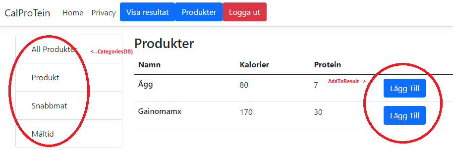
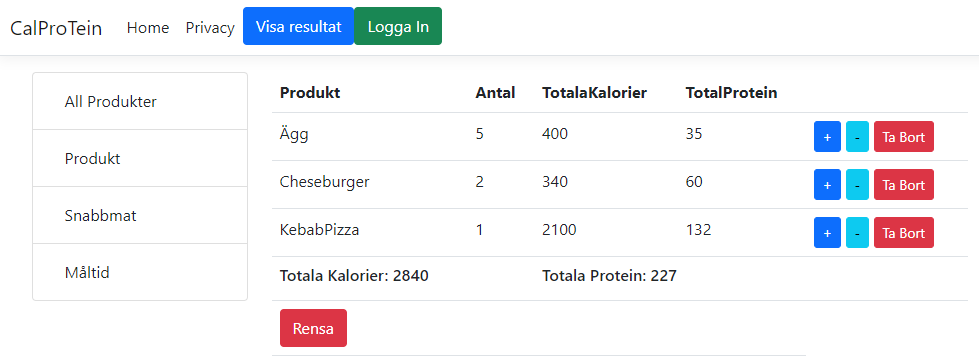
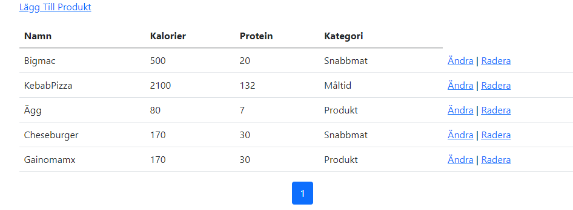

# CaloriesProteinTracker-Project

### Intro
- For daily tracking of calories and protein through a custom list.
- Developed in asp.net 6 core MVC(vs2022)
- Add items to DBList with Values("Name","Calories", "Protein"), from list add item with buttonClick to daily results where all added items combines and calculates protein and calorie intake both separate and total value off all.

### Lunch;
run "CalProTein.sln" inside VisualStudio (optional update packages), there will be some items and categories added through seeData.cs.
### Create an acount;
visit "http://localhost:5016/Account/Create" and fill out the form, loggin for access to the admin panel(where you add items).

## Demo IMG
Main page where you can browse categories and products

Result page with summary of all added items, where calculate value for individual items calorie and protein, then on the bottom print out total value from all items(total calories and protien of all items).

AdminArea;

### Improvments;
- add search, good when list gets long.
- signInPage.
- Create mobile-version/migration
